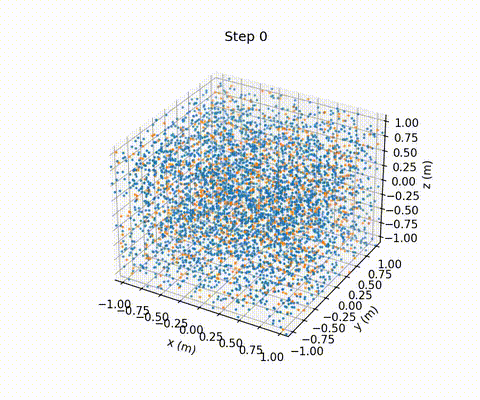
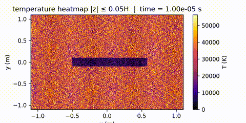
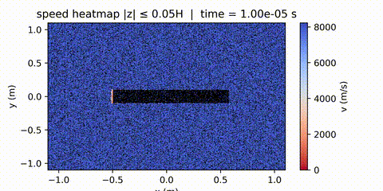
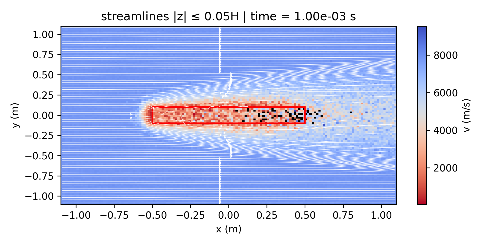
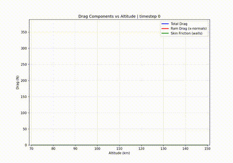
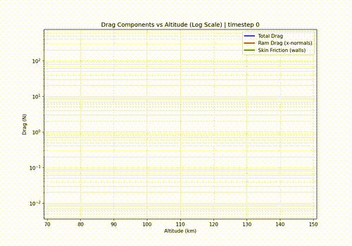
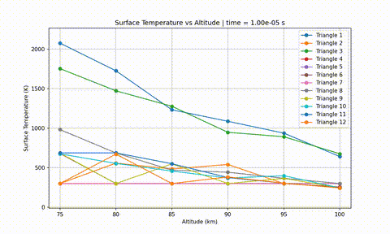

Updated Dec 10 2025

# VLEO-DSMC: Satellite Atmospheric Simulation with SPARTA

VLEO-DSMC is a simulation toolkit built on [SPARTA](https://sparta.github.io/) for analyzing spacecraft aerodynamics across flow regimes in **Very Low Earth Orbit (VLEO)** using the Direct Simulation Monte Carlo (DSMC) method. It integrates real NRLMSIS-2.0 atmospheric data to model the full thermospheric composition (N₂, O₂, O, He, Ar, N) with altitude-dependent species fractions from 70–500 km.

Import your satellite geometry as an STL file and compute aerodynamic drag, surface heating, velocity fields, and streamlines. The included Python scripts handle atmospheric data generation, dump file handling, and visualization. Particle animations, temperature heatmaps, flow field plots, and multi-altitude drag analysis are all supported out of the box. MPI parallelization enables faster execution on multi-core systems.

## Table of Contents
0. [Simulation Overview](#simulation-overview)
1. [Installing SPARTA](#1-install-sparta)
2. [Setting Up Python Environment](#2-set-up-python-environment)
3. [Running Simulations](#3-run-simulations)
4. [Converting Dump Data](#4-convert-dump-data-for-memory-efficient-analysis)
5. [Visualization and Analysis Scripts](#5-visualization-and-analysis-scripts)
6. [Atmospheric Data and Species Composition](#6-atmospheric-data-and-species-composition)
7. [Surface Geometry and STL Conversion](#7-surface-geometry-and-stl-conversion)
8. [Surface Collision Models and Accommodation](#8-surface-collision-models-and-accommodation)
9. [Drag Calculation Methods](#9-drag-calculation-methods)
10. [Input File Reference](#10-input-file-reference)
11. [Best Practices](#11-best-practices)

## 0. Simulation Overview

### What is DSMC?

**Direct Simulation Monte Carlo (DSMC)** is a computational method for simulating rarefied gas flows where the continuum assumption breaks down. Instead of solving fluid equations, DSMC tracks individual representative particles (each particle is really a cluster of many, many actual particles) and models molecular collisions probabilistically. This simulation toolkit uses SPARTA DSMC to render continuum, transition, and free molecular atmospheric flows around an orbiting spacecraft in VLEO using real NRLMSIS atmospheric data.

### How It Works

The following parameters are ideal for a high-fidelity ~30 minute simulation on my laptop (AMD Ryzen 9 5900HS, 8 cores/16 threads, 40GB RAM). For lower fidelity, decrease grid dimensions, number of particles, and time steps, but make sure that constraints are followed for computational accuracy. You can test run the program and it will immediately output what the maximum cell size and timesteps can be:

(example)
```
CELL SIZE MUST BE < 7.70136701893303 m
TIMESTEP MUST BE < 0.0224217529927786 s
```

#### Physical Domain
- **3D Cartesian domain:** 2.2m × 2.2m × 2.2m cube (±1.1m in each direction)
- **Boundary conditions:** 
  - X-direction: Outflow (gas escapes at +X boundary, injected at -X)
  - Y,Z-directions: Periodic (wraparound)
- **Grid resolution:** 350 × 200 × 50 cells
- **Cell size:** λ/3 (one-third of mean free path) for accurate collision modeling

#### Atmospheric Modeling
The simulation integrates real atmospheric data using the **NRLMSIS-2.0 empirical model**:
- **Density (ρ):** Mass density at specified altitude
- **Number density (nrho):** Molecular concentration 
- **Temperature (T):** Atmospheric temperature
- **Bulk velocity (vx):** Free-stream velocity (orbital speed at given altitude)

**Supported altitude range:** 70-500 km (thermosphere/mesopause region)
- NRLMSIS data extends to 1000 km, but current species data is most accurate for lower thermosphere
- Full atmospheric composition is now supported: N₂, O₂, O, He, Ar, N (see [Atmospheric Data](#4-atmospheric-data-and-species-composition))

#### Particle Representation
- **Target particles:** 500,000–2,000,000 computational particles (configurable via `Ns_target`)
- **Species:** Full NRLMSIS composition (N₂, O₂, O, He, Ar, N with altitude-dependent fractions)
- **Weighting factor:** Each computational particle represents ~10¹⁰-10¹² real molecules
- **Injection:** Continuous inflow of atmospheric gas at domain boundary

#### Collision Physics
**Variable Soft Sphere (VSS) Model:**
- **Probabilistic collisions:** Particles don't physically collide; instead collision probability is calculated based on:
  - Molecular cross-sections (σ ≈ 3.7×10⁻¹⁰ m diameter)
  - Relative velocities
  - Local density
- **Mean free path:** λ = kT/(√2πd²ρR) ≈ meters at high altitude
- **Collision frequency:** Determined by kinetic theory and local gas properties
- **VSS parameters:** Defined in `vss/air.vss` for all supported species (VSS = Variable Soft Sphere)

#### Surface Interactions
**Diffuse Surface Model:**
- **Surface geometry:** 3D satellite model (STL → surface mesh)
- **Temperature coupling:** Stefan-Boltzmann radiation (ε = 0.9, T₀ = 300K)
- **Molecular accommodation:** Gas molecules thermalize with surface temperature
- **Energy transfer:** Tracks kinetic + internal energy flux to surface

#### Time
- **Timestep:** 1×10⁻⁷ seconds (much smaller than collision time)
- **Duration:** 10,000 timesteps (1.0 milliseconds physical time)
- **Diagnostics:** Data output every 100 timesteps (100 frames total)

#### Scientific Applications
This simulation models **satellite atmospheric drag and heating** in the thermosphere, relevant for:
- Low Earth Orbit (LEO) satellite design
- Atmospheric re-entry analysis  
- Hypersonic vehicle aerothermodynamics
- Spacecraft surface temperature prediction

The DSMC method is essential at altitude ranges where the Knudsen number (Kn = λ/L > 0.1) indicates rarefied flow conditions that may violate continuum assumptions used in traditional CFD.

## 1. Install SPARTA

### Prerequisites

```bash
sudo apt update
sudo apt install build-essential gfortran mpich
```

### Build SPARTA

```bash
git clone https://github.com/sparta/sparta.git
cd sparta/src

# Build MPI version (recommended for multi-core execution)
make mpi      # Creates: spa_mpi

# Build serial version (single core only)
make serial   # Creates: spa_serial
```

**Which to use?** Build `spa_mpi` if you want to run simulations on multiple cores (recommended). The scripts in this repo (`run_sparta.sh`, `multi_altitude.py`) use `mpirun` and require `spa_mpi`.

### Create a symlink for convenience

To use `sparta` as the command name (as used in `run_sparta.sh` and `multi_altitude.py`):

```bash
cd ~/sparta/src
ln -s spa_mpi sparta       # Recommended: enables multi-core runs with mpirun
# OR for serial only:
ln -s spa_serial sparta
```

**Important:** If you plan to use `mpirun` for parallel execution, you **must** link to `spa_mpi`. Using `spa_serial` with `mpirun` will launch multiple independent serial processes instead of one parallel simulation - they won't communicate and results will be incorrect.

### Add to PATH

For **bash** (most common):
```bash
echo 'export PATH="$PATH:$HOME/sparta/src"' >> ~/.bashrc
source ~/.bashrc
```

For **tcsh/csh**:
```tcsh
echo 'setenv PATH "${PATH}:${HOME}/sparta/src"' >> ~/.cshrc
source ~/.cshrc
```

### Verify installation

```bash
sparta -h              # Should print help/version info
# OR test directly:
~/sparta/src/sparta -h

# Verify MPI is working (should say "Running on N MPI task(s)"):
mpirun -np 2 sparta -h
# Ignore the 'non-zero status' error that comes after this.
```

If `sparta -h` doesn't work but the direct path does, your PATH isn't set correctly for your shell.

**Additional SPARTA documentation:** Extensive documentation is available at https://sparta.github.io/ - I highly recommend perusing it; it isn't terribly long, it can be tremendously helpful, and getting an idea about what is included before you start will save you hours of troubleshooting!

## 2. Set Up Python Environment

```bash
cd ~/AMPT
python3 -m venv .venv
source .venv/bin/activate
pip install -r requirements.txt
```

You must run `source .venv/bin/activate` **every time you open a new terminal**  
(unless you're using system-wide Python via `apt`, which doesn't require activation)
I have it set up like this to isolate dependencies and guarantee it will run on any machine with just requirements.txt

To auto-activate in **VS Code** (not necessary):
- Press `Ctrl+Shift+P`
- Type `Python: Select Interpreter`
- Choose `.venv/bin/python` from the list

## 3. Running Simulations

### Single Altitude Simulation

```bash
# Generate atmospheric data for specific altitude (70-500 km)
python3 tools/load_atm_data.py 150

# Run SPARTA simulation (single core)
sparta < in.ampt

# OR run with multiple cores for faster execution
./run_sparta.sh    # Uses 8 cores by default. Modify this to work with your setup.
```

**Note:** `run_sparta.sh` uses `in.ampt` as the input file.

**Performance:** Multi-core execution is typically 4-6x faster for DSMC simulations. 

### Multi-Altitude Analysis

```bash
# Single core (default)
python3 multi_altitude.py

# Multi-core parallel execution (faster)
python3 multi_altitude.py --cores 8
python3 multi_altitude.py -c 4

# Edit altitude list in multi_altitude.py (default: 70, 80, 90, 100, 110, 120, 130, 140, 150 km)
```

This will:
- Run SPARTA simulations at each altitude using `in.ampt`
- Save results to `dumps/alt_XXkm/` directories  
- **Automatically convert dumps to Parquet format** for memory-efficient analysis  

**Performance:** Using `--cores 8` is typically 4-6x faster than single core for DSMC simulations.

**Important:** `multi_altitude.py` uses `in.ampt` as the input file. If you want to simulate a different geometry, rename your input file to `in.ampt` or modify the script.

### Analyze Multi-Altitude Results

After running multi-altitude simulations:

```bash
# Analyze drag vs altitude (animated plot + CSV export)
python3 scripts/analyze_multi_altitude_drag.py

# Export CSV only (no plot)
python3 scripts/analyze_multi_altitude_drag.py --csv

# Analyze surface temperature vs altitude (animated plot)
python3 scripts/analyze_multi_altitude_temp.py
```

Output files:
- `outputs/drag_vs_altitude.csv` - Total drag vs altitude data
- `outputs/ram_drag_vs_altitude.csv` - Ram drag component (if using cube geometry)
- `outputs/skin_friction_vs_altitude.csv` - Skin friction component (if using cube geometry)
- `outputs/multi_altitude_drag_evolution.mp4` - Animated drag plot (linear scale)
- `outputs/multi_altitude_drag_evolution_log.mp4` - Animated drag plot (log scale)
- `outputs/multi_altitude_temp_evolution.mp4` - Animated temperature plot

## 4. Convert Dump Data for Memory-Efficient Analysis

After running simulations, convert dump data to Parquet format for memory-efficient analysis:

```bash
# Convert dumps from default directory (dumps/)
python3 tools/load_dumps.py

# Convert dumps from specific directory
python3 tools/load_dumps.py dumps/alt_XXkm/
```

This will:
- Parse raw dump files (part.*.dat, grid.*.dat, surf.*.dat, flow.*.dat) 
- Save memory-efficient Parquet files (.parquet) in the same directory (uses significantly less RAM than pickle files)
- Can handle large (100 GB+) datasets without crashes
- Python analysis scripts automatically use Parquet files for streaming data access

Large SPARTA simulations can generate GB of particle data. The old pickle format was simpler in that it generated a single usable file for each set of dumps, but would cause RAM crashes when loading entire datasets. Parquet enables streaming access (i.e. loading only one timestep at a time) which reduces memory usage. 

### Parquet Loading Functions

For use in custom analysis scripts:

```python
from tools.load_dumps import load_parquet_timesteps, load_parquet_single

# Get list of available timesteps without loading data
timesteps = load_parquet_timesteps("particle", "dumps/alt_100km")

# Load a single timestep (memory efficient)
step, df, box = load_parquet_single("particle", timesteps[0], "dumps/alt_100km")
```

## 5. Visualization and Analysis Scripts

All visualization scripts are located in `scripts/` and output to `outputs/`. Most scripts default to reading from `dumps/` but can analyze specific altitude data.

### Particle Animation
```bash
python3 scripts/animate_particles.py [folder]
```
- Creates 3D scatter plot animation of particle positions
- Subsamples to 5000 particles for performance
- **Output:** `outputs/particle_anim.mp4`

<div align="center">
  
</div>

### Surface Temperature Heatmap
```bash
python3 scripts/surface_temp_heatmap.py [folder]
```
- Animated 3D visualization of surface temperatures with energy flux annotations
- Rotating view with colorbar
- **Output:** `outputs/surface_temp_heatmap.mp4`
- **Note:** Uses `in.ampt` to extract timestep size

<div align="center">
  
</div>

### Grid Temperature Heatmap
```bash
python3 scripts/grid_temp_heatmap.py [folder]
```
- 2D heatmap animation of gas temperature in a horizontal slice (|z| ≤ 5% of domain height)
- Uses native grid resolution from SPARTA
- **Output:** `outputs/grid_temp_heatmap.mp4`
- **Note:** Uses `in.ampt` to extract timestep size

<div align="center">
  
</div>

### Velocity Heatmap
```bash
python3 scripts/velocity_heatmap.py [folder]
```
- 2D heatmap animation of particle speed in a horizontal slice
- Uses 500×300 binning resolution
- **Output:** `outputs/velocity_heatmap.mp4`
- **Note:** Uses `in.ampt` to extract timestep size

<div align="center">
  
</div>

### Streamlines
```bash
# Static snapshot (final timestep)
python3 scripts/streamlines.py

# Animated streamlines
python3 scripts/streamlines.py --anim
```
- Visualizes flow field with streamlines overlaid on speed heatmap
- Uses flow dump data (per-cell velocity averages)
- Red rectangle indicates object outline
- **Output:** `outputs/streamlines_2d.png` or `outputs/streamlines_anim.mp4`

<div align="center">
  <table>
    <tr>
      <td align="center">
        <br>
        <sub>Static Streamlines</sub>
      </td>
      <td align="center">
        <br>
        <sub>Animated Streamlines</sub>
      </td>
    </tr>
  </table>
</div>

### Drag Analysis (Single Run)
```bash
python3 scripts/plot_drag.py [--show] [--out path.png] [--csv out.csv]
```
- Plots drag vs timestep from `dumps/direct_drag.dat`
- See [Drag Calculation Methods](#9-drag-calculation-methods) for details
- **Output:** `outputs/drag.png` (default)

### Multi-Altitude Drag Analysis
```bash
python3 scripts/analyze_multi_altitude_drag.py [--csv]
```
- Analyzes drag across multiple altitudes from `dumps/alt_*km/` directories
- Creates animated plots showing drag components vs altitude over time
- **Output:** 
  - `outputs/drag_vs_altitude.csv`
  - `outputs/multi_altitude_drag_evolution.mp4` (linear scale)
  - `outputs/multi_altitude_drag_evolution_log.mp4` (log scale)


<div align="center">
  <table>
    <tr>
      <td align="center">
        <br>
        <sub>Linear Scale</sub>
      </td>
      <td align="center">
        <br>
        <sub>Log Scale</sub>
      </td>
    </tr>
  </table>
</div>

### Multi-Altitude Temperature Analysis
```bash
python3 scripts/analyze_multi_altitude_temp.py
```
- Analyzes surface temperatures across multiple altitudes
- Creates animated plot showing temperature vs altitude over time
- **Output:** `outputs/multi_altitude_temp_evolution.mp4`

<div align="center">
  
</div>

### Usage Examples
```bash
# Default (uses dumps/ folder)
python3 scripts/animate_particles.py
python3 scripts/surface_temp_heatmap.py
python3 scripts/grid_temp_heatmap.py
python3 scripts/velocity_heatmap.py

# Analyze specific altitude results
python3 scripts/animate_particles.py dumps/alt_80km
python3 scripts/surface_temp_heatmap.py dumps/alt_100km
python3 scripts/grid_temp_heatmap.py dumps/alt_75km
python3 scripts/velocity_heatmap.py dumps/alt_95km
```

**Note:** 
- Run `python3 tools/load_dumps.py <folder>` first to convert dump data to Parquet format
- Scripts now use streaming data access, preventing RAM crashes on large datasets - no more catastrophic failure :)
- All output files (.mp4, .png, .csv) are saved to the `outputs/` folder

## 6. Atmospheric Data and Species Composition

### How Atmospheric Data is Generated and Used

The atmospheric data pipeline works as follows:

1. **Generate NRLMSIS data:** Run `python3 tools/load_atm_data.py <altitude_km>` to query NRLMSIS-2.0 for atmospheric properties at the specified altitude.

2. **Data files created in `data/`:**
   - `nrlmsis.dat` - Full NRLMSIS dataset (70-500 km) with columns:
     - Altitude (km), Temperature (K), Density (kg/m³), Pressure (Pa), Pressure (Torr), Orbital Velocity (m/s), Number Density (m⁻³), n_N2, n_O2, n_O, n_He, n_Ar, n_N
   - `atm.sparta` - SPARTA include file with all atmospheric variables, species, and mixture definitions

3. **Contents of `data/atm.sparta`:** This file is auto-generated with all atmospheric data for the specified altitude:
   ```
   # NRLMSIS-2.0 atmospheric data for 150 km altitude
   # Generated by load_atm_data.py

   variable        rho  equal 1.234567e-09
   variable        nrho equal 2.345678e+16
   variable        T    equal 634.123456
   variable        vx   equal 7814.2

   species         species/air.species N2 O2 O He Ar N
   mixture         atm N2 frac 0.5379
   mixture         atm O2 frac 0.0379
   mixture         atm O  frac 0.4213
   mixture         atm He frac 0.0005
   mixture         atm Ar frac 0.0009
   mixture         atm N  frac 0.0015
   ```
   (Example shown for ~150 km altitude; values vary with altitude)

4. **Loading in SPARTA:** The `in.ampt` file simply includes the file:
   ```
   include         data/atm.sparta
   mixture         atm nrho ${nrho} vstream ${vx} 0.0 0.0 temp ${T}
   ```

### Species Data Files

- **`species/air.species`** - Molecular properties (mass, rotational/vibrational DOF, etc.) for N₂, O₂, O, N, He, Ar, and ionized species
- **`vss/air.vss`** - Variable Soft Sphere collision parameters (diameter, omega, tref, alpha) for each species

## 7. Surface Geometry and STL Conversion

### Converting STL Files to SPARTA Surface Format

SPARTA requires surface files in its native `.surf` format. Use `stl2surf.py` to convert:

```bash
python3 tools/stl2surf.py models/your_model.STL surf/your_model.surf
```

**Features:**
- Accepts both ASCII and binary STL files
- Automatically converts mm → m (divides coordinates by 1000)
- Auto-centers the model at the origin
- Warns if the surface is not watertight (important for closed bodies)

**Example:**
```bash
python3 tools/stl2surf.py models/AMPT_sat_inlet.STL surf/AMPT_sat_inlet.surf
```

### Available Surface Files

Located in `surf/`:
- `cube.surf` - 1m × 1m × 1m cube centered at origin (12 triangles)
- `AMPT_sat_inlet.surf` - AMPT satellite geometry
- `sat_inlet_radiator.surf`, `sat_inlet.surf`, etc. - Various satellite configurations
- `xlo_bdy.surf`, `xhi_bdy.surf` - Transparent boundary planes for flux measurement

### Transparent Boundary Surfaces

For drag calculations using momentum flux, transparent boundary surfaces are placed upstream and downstream:
- `xlo_bdy.surf` - Upstream plane at x = -1.0 m
- `xhi_bdy.surf` - Downstream plane at x = +1.0 m

These are read with the `transparent` flag in SPARTA and don't interact with particles—they only measure fluxes.

## 8. Surface Collision Models and Accommodation

### Accommodation Coefficients

The accommodation coefficient (α) determines how much a gas molecule thermalizes with the surface:
- **α = 1.0 (fully diffuse):** Molecule leaves surface at surface temperature with random direction
- **α = 0.0 (fully specular):** Molecule reflects like a billiard ball, conserving tangential momentum
- **0 < α < 1:** Partial accommodation (interpolated behavior)

### Input File Configurations

**`in.ampt` (Cube with Different Face Treatments):**

This configuration is used for studying ram drag vs skin friction separately on a cube geometry:

```
# Surface groups for different face orientations
read_surf       surf/cube.surf  group ampt
group           ampt_xnorm surf id 1:4      # front/back faces (ram direction)
group           ampt_yznorm surf id 5:12    # side walls

# Define collision models with different accommodation
surf_collide    wall_diffuse diffuse s_Tsurf 1     # α=1.0 for ram faces
surf_collide    wall_specular diffuse s_Tsurf 0.3  # α=0.3 for side walls

# Apply to respective surface groups
surf_modify     ampt_xnorm collide wall_diffuse
surf_modify     ampt_yznorm collide wall_specular
```

This allows separate calculation of:
- **Ram drag:** Force on x-normal faces (directly facing the flow)
- **Skin friction:** Force on y/z-normal faces (parallel to flow)

**`in.ampt_actual` (General Purpose - Uniform Accommodation):**

For simulating arbitrary geometries where face-specific treatment is not needed:

```
surf_collide    wall diffuse s_Tsurf 0.9    # Single collision model, α=0.9
surf_modify     ampt collide wall           # Apply to all surfaces
```

**Recommendation:** For general simulations with complex geometry, use `in.ampt_actual`. The cube-specific `in.ampt` is primarily for validation studies where separating ram and skin friction is important.

### Scripts That Depend on `in.ampt`

The following scripts explicitly use `in.ampt` as the input file and expect the cube geometry with face groupings:

- **`run_sparta.sh`** - Runs `sparta -in in.ampt`
- **`multi_altitude.py`** - Runs simulations using `in.ampt`
- **`scripts/surface_temp_heatmap.py`** - Reads timestep from `in.ampt`
- **`scripts/grid_temp_heatmap.py`** - Reads timestep from `in.ampt`
- **`scripts/velocity_heatmap.py`** - Reads timestep from `in.ampt`
- **`scripts/streamlines.py`** - Reads timestep from `in.ampt`
- **`scripts/plot_drag.py`** - Reads domain size from `in.ampt`

**To use these scripts with a different geometry:** Either rename your input file to `in.ampt`, or modify the filename reference in the script.

## 9. Drag Calculation Methods

The `plot_drag.py` script computes drag using two methods:

### Direct Sum Method (Recommended)

Forces on each surface element are computed directly by SPARTA and summed:

```
compute         surfF surf ampt atm fx fy fz
fix             surfavg ave/surf ampt 1 1 1 c_surfF[*] ave running
compute         drag reduce sum f_surfavg[1]
```

This method:
- Sums x-component of forces imparted by gas molecules on all surface faces
- Uses running time-average to reduce statistical noise
- **Has been validated analytically and against existing literature to within ~2%**

For the cube geometry (`in.ampt`), drag is decomposed into:
- **Ram drag:** Forces on x-normal faces (front/back)
- **Skin friction:** Forces on y/z-normal faces (side walls)

### Momentum Flux Method (Experimental - Do Not Use)

An alternative method using momentum flux through upstream/downstream transparent planes:

```
compute         xlo_flux surf xlo_bdy atm mflux ke nflux
compute         xhi_flux surf xhi_bdy atm mflux ke nflux
```

Drag is computed as: F ≈ (Π_lo - Π_hi) × A, where Π = Φ_m × v

**!! Warning:** This method does not accurately reconstruct simulated number or mass densities. I suspect there a fundamental issue with how SPARTA's transparent surfaces detect particles (the actual calculations of fluxes follow my formulations, but I still calculate the wrong values). **The boundary momentum-flux line on the drag plot should be ignored.** Use only the direct drag values.

### Output Files

Drag data is written to:
- `dumps/direct_drag.dat` - Timestep, total drag, ram drag, skin friction
- `dumps/xlo_flux.dat` - Upstream boundary fluxes (mass, energy, number flow rates)
- `dumps/xhi_flux.dat` - Downstream boundary fluxes
- ^ Don't worry about those last two, they're for momentum flux calcs

## 10. Input File Reference

### Available Input Files

| File | Description | Use Case |
|------|-------------|----------|
| `in.ampt` | Cube geometry with face-specific accommodation | Validation, ram vs skin friction studies |
| `in.ampt_actual` | General geometry with uniform accommodation | Production simulations with complex geometry |
| `in.ampt_box` | Original slender box configuration | Testing |

### Key Parameters in `in.ampt` as of this commit (these may have changed)

| Parameter | Value | Description |
|-----------|-------|-------------|
| `xmin/xmax` | -3 to 3 | Domain x-bounds (m) |
| `ymin/ymax` | -3 to 3 | Domain y-bounds (m) |
| `zmin/zmax` | -3 to 3 | Domain z-bounds (m) |
| `create_grid` | 150 100 50 | Grid cells in x, y, z |
| `Ns_target` | 500000 | Target number of simulation particles |
| `diag_freq` | 100 | Dump output frequency (timesteps) |
| `tstep` | 1.0e-7 | Timestep size (s) |
| `run` | 2000 | Number of timesteps to run |

### Key Parameters in `in.ampt_actual`

| Parameter | Value | Description |
|-----------|-------|-------------|
| `xmin/xmax` | -1.5 to 1.1 | Tighter domain bounds (m) |
| `ymin/ymax` | -1.1 to 1.1 | Domain y-bounds (m) |
| `zmin/zmax` | -1.1 to 1.1 | Domain z-bounds (m) |
| `Ns_target` | 2000000 | Higher particle count |
| `run` | 5000 | Longer simulation |
| `surf_collide` | diffuse s_Tsurf 0.9 | Uniform α=0.9 accommodation |

## 11. Best Practices

### Clearing Dump Files Between Runs

**Important:** It is good practice to clear the `dumps/` folder between simulation runs:

```bash
rm -f dumps/*.dat
```

The `in.ampt` files automatically do this at the start of each run (make sure you don't leave any important .dat files in there!):
```
shell "bash -c 'rm -f dumps/*.dat'"
```

However, if dumps are stored in subfolders (e.g., `dumps/alt_100km/`), they will persist. This is useful for keeping multi-altitude results.

**Note:** Parquet files (`.parquet`) from previous conversions will also persist. Delete them manually if needed. These should probably be auto deleted during load_dumps.py, but it's late and I'm too tired to think about the implications of doing so. Submit a pull request if you have a problem with it, or anything else for that matter:
```bash
rm -f dumps/*.parquet
```

### Simulation Constraints

SPARTA will output the required constraints at startup:
```
CELL SIZE MUST BE LESS THAN X m
TIMESTEP MUST BE < Y s
```

Ensure your grid resolution and timestep satisfy these constraints for accurate results. My source for these values is a YouTube video that has been lost to the depths of my watch history. It has a guy lecturing over powerpoint slides and one of them has a cow in it. You can also just modulate these parameters until things converge, but this is a good starting point and to be honest I trust the guy with the microphone more.

### Memory Management

- Use `tools/load_dumps.py` to convert raw dumps to Parquet before analysis
- Analysis scripts use streaming access to avoid loading entire datasets into RAM
- For very large simulations (>10GB dumps), consider analyzing one altitude at a time

### Validation

Direct drag calculations have been validated:
- Analytically against kinetic theory predictions
- Against existing literature to within ~2% accuracy

For critical applications, perform convergence studies by varying:
- Grid resolution
- Number of particles
- Timestep size
- Simulation duration

Good luck - and most importantly, have fun!